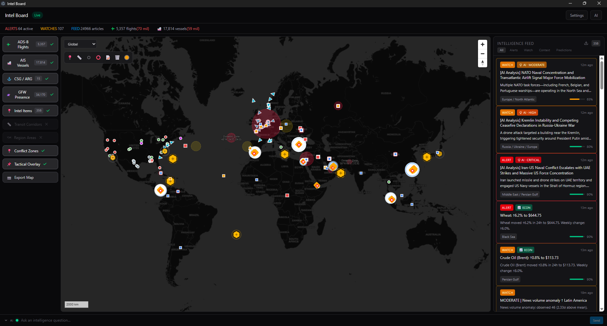
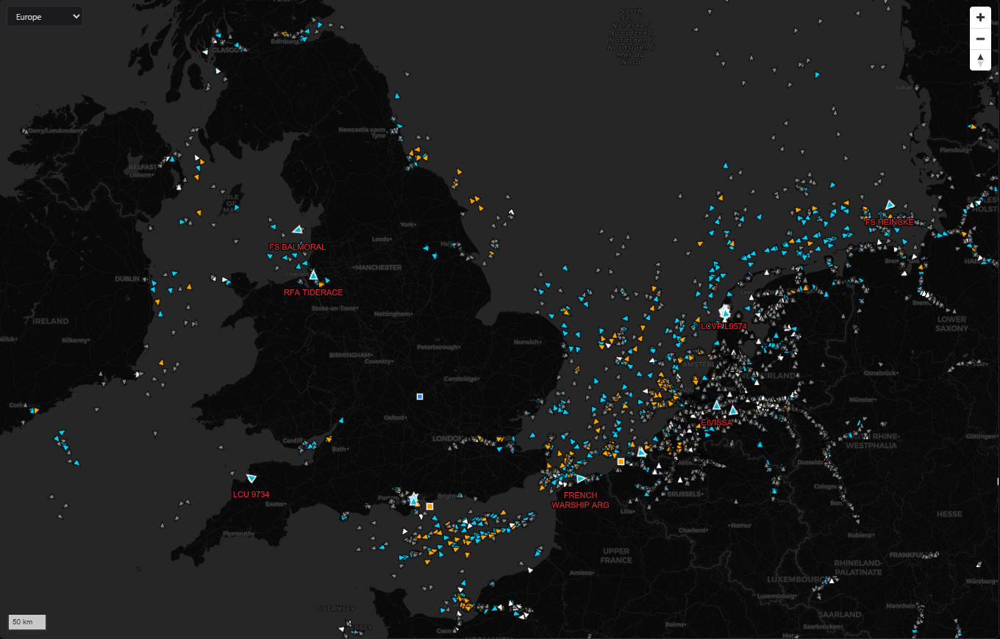
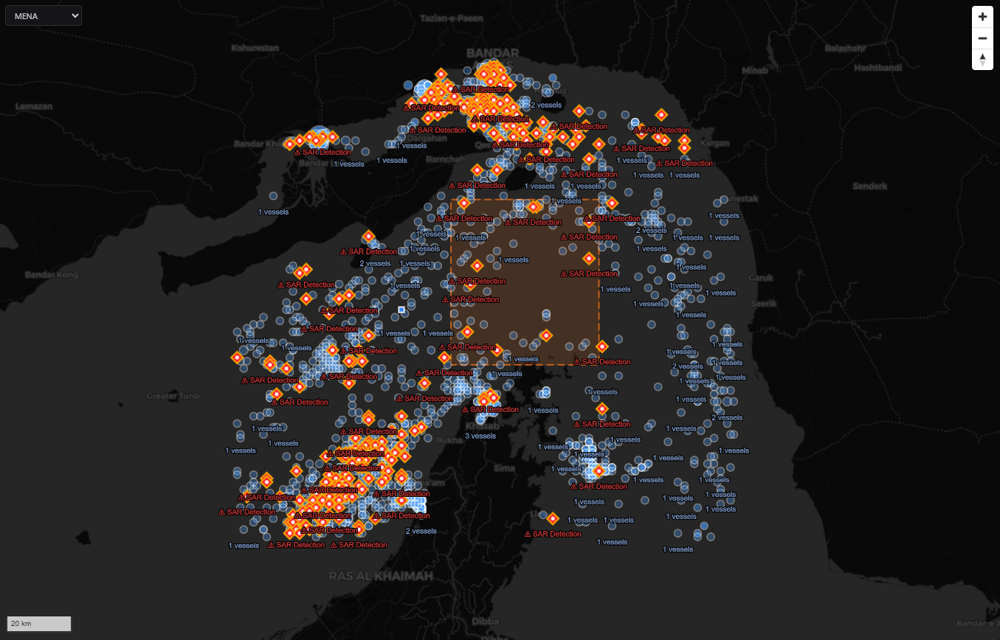
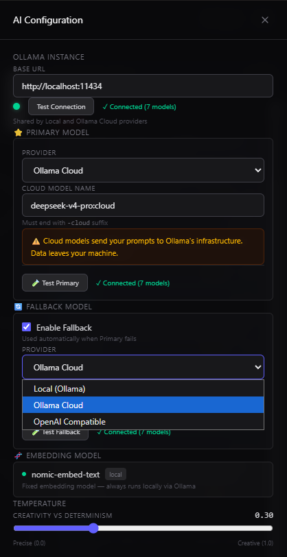

# Intel Board

Real-time OSINT intelligence dashboard with AI-powered analysis, carrier strike group tracking, flight monitoring, and RAG-grounded sense-making. Every AI claim cites its sources.

Built with Electron, React, TypeScript, SQLite, MapLibre, Tailwind CSS, and local/cloud AI.

## What It Does

Intel Board is a desktop application that aggregates open-source intelligence from multiple feeds, detects anomalies and tactical events, tracks military deployments, and uses AI to generate predictions, sense-making analyses, and connections between disparate data points. It's designed for researchers, analysts, and anyone who needs to synthesize information from multiple sources into actionable intelligence.

**Key features:**

### Data Collection
- **Multi-source ingestion** — GDELT Global Knowledge Graph, RSS feeds, Google News, custom scrapers
- **USNI Fleet Tracker** — Automated scraping of US Naval Institute's fleet and carrier strike group tracker
- **The War Zone scraper** — Defense news from TWZ.com with AI-powered extraction
- **ADS-B/aircraft tracking** — Real-time military aircraft detection via tar1090/AirNav
- **AIS vessel tracking** — Maritime traffic monitoring with vessel identification
- **Economic indicators** — Commodity prices, currency data, bond yields
- **Social media monitoring** — Configurable Twitter/social feed tracking

### Analysis
- **AI Sense-Making** — Cross-source fusion analysis every 30 minutes. The AI reads all available intel and produces tactical assessments with full citations.
- **Anomaly Detection** — Statistical baselines for flight activity, shipping patterns, economic metrics. Flags deviations automatically.
- **Tactical Events** — Automated identification of military aircraft, naval deployments, and significant movements. Category-aware TTL (4h aircraft, 24h naval).
- **Predictions** — AI generates specific, verifiable predictions from detected anomalies. Self-calibrating: tracks accuracy over time, adjusts confidence based on historical performance, learns from failure patterns.
- **Prediction Review** — Autonomous review of past predictions using RAG evidence gathering. LLM judges accuracy with cited sources. Calibration data feeds back into future predictions.

### Visualization
- **MapLibre dark map** — Dark-themed map with layered overlays: carrier strike groups, flight tracks, conflict zones, ship positions, alert zones, transit corridors, custom drawing. Uses free CARTO/OpenStreetMap tiles (no API key needed).
- **Carrier Strike Group tracking** — Live CSG/ARG positions with vessel breakdowns, operating areas, and staleness indicators
- **Intel Feed** — Tiered feed: active predictions, overdue items, analyzed results. Color-coded by type and urgency.
- **Alert Rules** — User-defined rules for automatic notifications on keywords, regions, or event types

### AI Features
- **RAG-grounded chat** — Ask questions about current events, get answers with clickable source citations
- **Two-slot model config** — Primary + fallback AI models with automatic failover. Supports local Ollama, cloud OpenAI-compatible APIs, or any combination.
- **World context** — Current world leaders, roles, and geopolitical context injected into AI prompts for accuracy
- **Connection discovery** — AI identifies links between intel items from different sources
- **Source verification** — Every AI claim links back to its source document

## Prerequisites

- **Node.js** 20.19+ or 22.12+ ([required by electron-vite](https://electron-vite.org/))
- **npm**
- **Ollama** (optional but recommended) — For local AI. Needs a chat model and `nomic-embed-text` for embeddings.

Alternative: Any OpenAI-compatible API endpoint (OpenAI, Together, DeepSeek, etc.) works for cloud AI.

## Setup

### Prerequisites (Windows)

1. **Node.js 22+** — Download from [nodejs.org](https://nodejs.org). LTS recommended.
2. **Git** — Download from [git-scm.com](https://git-scm.com)
3. **Python 3.8+** — Required by `better-sqlite3` native build. Download from [python.org](https://python.org). Make sure "Add Python to PATH" is checked during install.
4. **Visual Studio Build Tools** — Required for native module compilation. Install one of:
   - **Visual Studio 2022 Community** (free) with "Desktop development with C++" workload, OR
   - **Build Tools for Visual Studio 2022** (lighter) from [visualstudio.microsoft.com](https://visualstudio.microsoft.com/visual-cpp-build-tools/) — select "Desktop development with C++"
5. **Ollama** (optional but recommended) — Local AI inference. Download from [ollama.com](https://ollama.com). After install, pull at least one model:
   ```bash
   ollama pull nomic-embed-text   # Embedding model (required for RAG)
   ollama pull qwen2.5:3b         # Chat model
   ```

### Quick Start

```bash
git clone https://github.com/w4gon79/intel-board.git
cd intel-board
npm install
npm run dev
```

The app opens to the situation map with the intelligence feed panel.

> **Windows users:** You need Python 3.8+ and Visual Studio Build Tools (see Prerequisites above) before `npm install` will succeed. The `better-sqlite3` native module requires a C++ compiler.

On first launch, open **Settings** (gear icon) to configure your API keys. The app works with partial configuration but more sources = better analysis.

### Remote Access (Phone/Browser)

The HTTP server starts automatically on port 8902. Access the dashboard from any device on your network:
```
http://<your-ip>:8902
```

## Configuration

All configuration is done through the **Settings** panel in the app. No `.env` files needed.

### API Keys

Open Settings → **API Keys** tab. Each key has a signup link and a Test button to verify it works.

| Key | Required | Free? | Purpose |
|-----|----------|-------|---------|
| News API Key | Recommended | Yes (100 req/day) | News articles from newsapi.org |
| OpenSky Username + Password | Recommended | Yes (4K req/day) | Live aircraft tracking via opensky-network.org |
| AISStream API Key | Recommended | Yes | Real-time ship tracking via aisstream.io |
| GFW API Token | Optional | Yes (non-commercial) | Vessel presence data from globalfishingwatch.org |
| FRED API Key | Optional | Yes (120 req/min) | Economic indicators from fred.stlouisfed.org |

Services without API keys (GDELT, Google News RSS, Open-Meteo weather) work out of the box.

### AI Model Configuration

Open Settings → **AI** tab:

- **Primary Model** — Main AI for analysis, chat, and predictions
- **Fallback Model** — Used automatically if primary fails
- **Embedding Model** — For RAG vector search (default: `nomic-embed-text`)

Supports local Ollama, Ollama cloud models (e.g., `deepseek-v4-pro:cloud`), and OpenAI-compatible APIs. Any combination works.

**Local Ollama setup:**
```bash
# Install Ollama from https://ollama.com
ollama pull nomic-embed-text   # Embedding model (required for RAG)
ollama pull qwen2.5:3b         # Chat model (or any model you prefer)
```

### Map

Uses free CARTO/OpenStreetMap dark tiles. No API key or configuration needed.

## Scripts

| Command | Purpose |
|---------|---------|
| `npm run dev` | Dev server with HMR |
| `npm run build` | Typecheck + production build |
| `npm start` | Preview production build |
| `npm run typecheck` | TypeScript check (`tsc --noEmit`) |

### Building a Desktop App

To create a standalone installer (Start Menu shortcut, desktop icon, the works):

```bash
npm run build:win      # Windows (NSIS installer)
npm run build:mac      # macOS (.dmg)
npm run build:linux    # Linux (AppImage + .deb)
```

The installer appears in `dist/`. Double click to install like any desktop app.

> **Note:** First build takes 2-5 minutes because it downloads and packages the Electron runtime (~150MB). Subsequent builds are much faster.

### Keeping Updated

```bash
git pull origin main
npm install            # in case dependencies changed
npm run dev            # or npm run build:win for a fresh installer
```

If you hit native module errors after updating, try:

```bash
npm run postinstall    # rebuilds better-sqlite3 etc.
```

## Project Structure

```
src/
  main/
    index.ts                     # Electron main process, startup sequence
    ipc/                         # IPC handlers (predictions, settings, CSG, etc.)
    services/
      analysis/
        predictor.ts             # AI prediction engine with calibration
        predictionReviewer.ts    # Autonomous prediction review & self-calibration
        senseMakingEngine.ts     # Cross-source fusion analysis
      identification/
        tacticalEngine.ts        # Military event detection & classification
      ingestion/
        pipeline.ts              # Multi-source data ingestion
      rag/
        llm.ts                   # Two-slot LLM service (primary + fallback)
        vectordb.ts              # Vector search for RAG
      csg/
        csgService.ts            # Carrier strike group orchestration
        usniScraper.ts           # USNI fleet tracker scraper + AI parser
        twzScraper.ts            # The War Zone defense news scraper
        aisMatcher.ts            # AIS vessel matching (disabled for CSG)
      economic/
        economicService.ts       # Commodity/currency/bond tracking
      storage/
        database.ts              # SQLite setup, migrations
        dbService.ts             # Query functions for all domains
        vectordb.ts              # Vector embedding storage & search
  renderer/src/
    components/
      layout/                    # AppShell, header, feed panel, AI strip
      map/                       # SituationMap, layer controls, overlays
      feed/                      # IntelFeedCard, PredictionCard
      settings/                  # Settings panels, AI config
      source/                    # Source citation panel
  shared/
    types.ts                     # Shared TypeScript types
```

## Database

SQLite via `better-sqlite3`. Auto-migrated on startup. Key tables:

- `intel_items` — All ingested intelligence with TTL and dedup
- `tactical_events` — Detected military events (aircraft, naval)
- `carrier_groups` / `carrier_group_vessels` — CSG/ARG tracking
- `predictions` / `prediction_reviews` — Prediction + self-calibration
- `prediction_calibration` — Accuracy tracking by category/region
- `anomalies` / `baseline_stats` — Statistical anomaly detection
- `articles` — Stored news articles
- `flights` / `vessels` — Real-time tracking data
- `alert_rules` — User-defined notification rules
- `economic_indicators` — Price/yield data

All data lives in `data/intel-board.db`.

## Architecture Notes

- **ISO 8601 timestamps** — All datetime columns store ISO 8601 format. SQL comparisons must wrap columns in `datetime()` for correct comparison against `datetime('now')`.
- **Self-calibrating predictions** — The predictor sees its own accuracy history and adjusts confidence. Categories with <25% accuracy skip predictions entirely. Failure patterns are analyzed and stored.
- **Layered event detection** — Raw data flows through tactical engine → anomaly detection → sense-making → predictions, each layer building on the last.
- **CSG data is USNI-only** — Carrier strike group positions come exclusively from USNI/TWZ intel, not AIS (military AIS is unreliable).

## Tech Stack

| Component | Technology |
|-----------|-----------|
| Framework | Electron + electron-vite |
| UI | React + TypeScript + Tailwind CSS |
| Database | SQLite (better-sqlite3) |
| Map | MapLibre GL JS + CARTO dark tiles (free, no API key) |
| AI | Ollama (local) and/or OpenAI-compatible APIs |
| Vector Search | JSON-stored embeddings + cosine similarity |
| Scraping | Custom HTTP + AI-powered extraction |
| Data Sources | GDELT, RSS, Google News, ADS-B, AIS |

## Screenshots

### Situation Map



### AIS Vessel Tracking



### Transit Corridors & Choke Points



### AI Configuration



## License

This project is licensed under the [GNU Affero General Public License v3.0](LICENSE).
